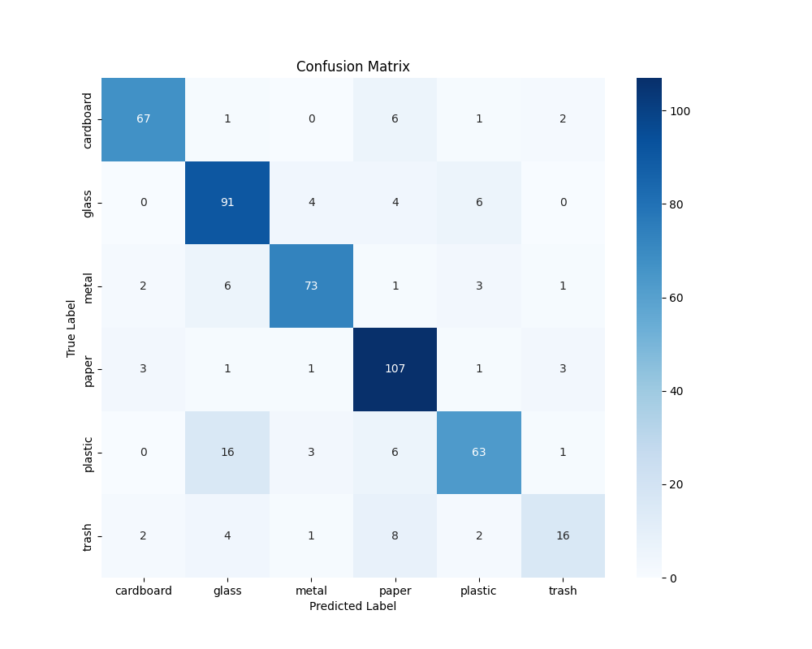
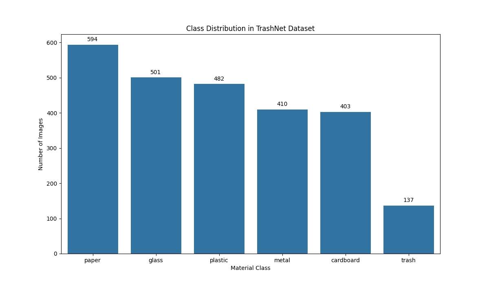

# End-to-End ML Pipeline for Real-Time Material Classification

This project implements a complete, end-to-end machine learning pipeline to classify images of scrap materials in a simulated real-time environment. The system handles everything from data preprocessing and model training to lightweight deployment and performance logging.

---

## 📋 Key Features

* **Data Augmentation:** Uses techniques like random flips and rotations to create more training data, which helps the model generalize better.
* **Transfer Learning:** Uses a pre-trained MobileNetV2 model to speed up training and improve accuracy.
* **Lightweight Deployment:** The trained model is converted to the ONNX format, which is fast and efficient for making predictions.
* **Real-Time Simulation:** Includes a script that simulates a conveyor belt, classifying images one by one and logging the results.
* **Performance Evaluation:** Comes with scripts to generate a detailed classification report and a confusion matrix to measure the model's performance.

---

## 📁 Folder Structure
The project has an organized folder structure to keep the code, data, models, and results separate.

scrap_classification_pipeline/
├── data/               # Contains the image dataset (e.g., cardboard/, glass/)
├── models/             # Stores the trained model files (.pth and .onnx)
├── results/            # Contains output files like logs and plots
├── src/                # All Python source code
│   ├── __init__.py
│   ├── config.py
│   ├── data_preprocessing.py
│   ├── eda.py
│   ├── evaluate.py
│   ├── export_to_onnx.py
│   ├── inference.py
│   └── simulation.py
├── .gitignore
├── README.md           # This file
└── requirements.txt    # Project dependencies

---

## 🛠️ Technical Details

`Dataset: TrashNet`
This project uses the TrashNet dataset, which is a public collection of images for waste classification. It contains 2,527 images across 6 classes: cardboard, glass, metal, paper, plastic, and trash. A quick analysis of the dataset shows the number of images per class, which is visualized below.

`Model Architecture: MobileNetV2`
The model is a MobileNetV2 Convolutional Neural Network (CNN). This architecture was chosen because it is designed to be efficient and fast. Transfer learning was applied by using a model pre-trained on the ImageNet dataset, which helps achieve good results even with a relatively small dataset.

`Deployment: ONNX`
For the deployment step, the trained PyTorch model (.pth) is converted to the ONNX (Open Neural Network Exchange) format. ONNX models are lightweight and can run on many different platforms, making them a good choice for real-world applications.

---

## 📊 Performance Evaluation

The model achieved an overall accuracy of 82% on the validation set.

The confusion matrix below provides a more detailed look at the model's performance for each class. The diagonal line shows the number of correct predictions. While the model is strong on most classes, the matrix shows it can sometimes confuse materials like plastic, metal, and glass.

A more detailed report with precision and recall scores can be generated by running python -m src.evaluate.

---

## 🚀 Getting Started

Follow these instructions to set up the project and run the pipeline.

1. Setup the Environment
This project uses a Conda environment to manage dependencies.

# First, create the Conda environment using Python 3.9
`conda create --name scrap_env python=3.9 -y`

# Next, activate the environment
`conda activate scrap_env`

2. Install Dependencies
All required packages are listed in the requirements.txt file.

# Install the uv package installer, which is faster than pip (optional)
`pip install uv`

# Install all dependencies from the requirements file
`uv pip install -r requirements.txt`

3. Run the Full Pipeline
Execute the following scripts from the project's root directory in order.

# 1. Train the model. This will save the best model to the /models folder.
`python -m src.train`

# 2. Convert the trained PyTorch model to the lightweight ONNX format.
`python -m src.export_to_onnx`

# 3. Run the final conveyor belt simulation. This will create a log in the /results folder.
`python -m src.simulation`

You can also run the evaluation scripts at any time after the model is trained:

# (Optional) Generate the classification report and confusion matrix
`python -m src.evaluate`

# (Optional) Generate the dataset class distribution plot
`python -m src.eda`